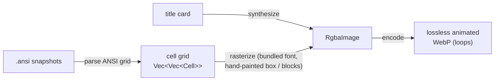

# AnsiDrama

[](https://github.com/oetiker/ansidrama/actions/workflows/ci.yml)

**Script a terminal session into a crisp, tiny, looping WebP — perfect for a
README.** One static binary renders every frame itself: no browser, no ffmpeg,
no asciinema, no runtime dependencies.


That trailer is itself an AnsiDrama recording — in it you can watch `ansidrama
record hello.toml` run for real. Here is the little WebP that command produces:


You script the scenes in TOML — typed commands, keypresses, friendly mouse
moves, silent-movie title cards — and every frame is rendered deterministically.

AnsiDrama renders each frame itself: it parses the terminal's ANSI cell grid
and rasterizes it with a bundled monospace font, hand-painting box-drawing and
block glyphs so `─│═▒█…` reach the exact cell edges and tile seamlessly. The
result is a lossless, sharp, loopable WebP that stays small — ideal for a README.



## Two commands

### `encode` — the primitive: frames → WebP

Bring your own frames. Each frame is a captured ANSI snapshot
(`tmux capture-pane -e -p -N > 001.ansi`, or from any harness) **or** a synthetic
title card, held for a duration.

```toml
# demo.toml
cols = 100
rows = 30
out  = "demo.webp"

[[frame]]
card    = { lines = ["eDAPtor", "", "a schema-driven LDAP editor"], fg = "#fef9c3", bg = "#111", bold = true }
hold_cs = 150

[[frame]]
file    = "001.ansi"
hold_cs = 200
```

```sh
ansidrama encode demo.toml            # writes demo.webp
ansidrama encode demo.toml -o out.webp --dump-png frames/
```

### `record` — drive a command in an embedded terminal, capture each frame

```toml
# record.toml
launch       = "myapp --config demo.toml"
cols         = 100
rows         = 30
font_px      = 18         # terminal font (small is fine — it's a dense capture)
card_font_px = 44         # title-card font (larger — read at a glance)
max_fps      = 30         # clamp minimum frame duration
type_cs      = 8          # hold per key / typed char (centiseconds)
move_cs      = 3          # hold per mouse cell-step
out     = "docs/demo/myapp.webp"
env     = { COLORTERM = "truecolor" }
quit_keys = ["C-c"]

[[scene]]
card    = { text = "A quick tour", fg = "#fef9c3" }
hold_cs = 300             # cards want a long hold — time to read

[[scene]]
keys    = ["Down", "Down", "Enter"]   # one frame captured PER key
hold_cs = 100

[[scene]]
click   = { x = 10, y = 11 }          # friendly mouse — no escape codes
hold_cs = 100

[[scene]]
drag    = { from = [18, 8], to = [44, 20] }   # animates one frame per cell
type_cs = 4                                   # per-scene speed override
hold_cs = 120
```

```sh
ansidrama record record.toml
```

## Scenes & frames

Each `record` scene **expands into many frames** — one captured **per key**, **per
typed character**, and **per mouse cell-step** — so keyboard and mouse actions play
out step by step (a corner drag *animates* the resize; typing appears char by
char). Cursor-only moves reuse the last capture; drags re-capture each step so live
UI is shown.

| Field    | Meaning |
|----------|---------|
| `keys`   | named keys, one frame captured per key: `["F10", "Down", "Enter"]` |
| `text`   | a string typed literally, one frame per character |
| `click`  | `{ x, y, button = "left" }` — the pointer moves in, then press + release |
| `drag`   | `{ from = [x,y], to = [x,y], button = "left" }` — one frame per cell |
| `scroll` | `{ x, y, dir = "down", n = 3 }` |
| `card`   | a title card (see below) — no terminal interaction |
| `file`   | (encode only) path to a captured `.ansi` snapshot |

**Timing** (all centiseconds):

| Field | Scope | Meaning |
|-------|-------|---------|
| `hold_cs` | per scene | hold on the **final** frame of the scene — the pause on the result |
| `type_cs` | global + per-scene | hold per key / typed-char frame (typing speed) |
| `move_cs` | global + per-scene | hold per mouse cell-step frame (pointer speed) |
| `font_px` | global | terminal font size → cell size → output resolution |
| `card_font_px` | global + per-card | title-card font (cards aren't bound to the cell grid) |
| `max_fps` | global | clamps the minimum per-frame hold |

Keyboard/typing frames draw the app's **text caret** (from the embedded terminal's cursor); mouse
frames draw the **pointer** — set `cursor = false` to disable both.

Exactly one action per scene. Coordinates are 1-based terminal columns/rows. Mouse
actions expand to SGR (1006) mouse reports under the hood, so you never write
`\x1b[<0;10;11M` by hand — a raw escape in `keys` still works as an escape hatch.

## Waiting for the app to finish drawing

`record` doesn't fire an input, hold for a fixed time, and hope the screen is
settled by then. It samples the terminal grid continuously and paces on
**stability** — a screen that has stopped changing — with the sampling
governed by a few global keys (all milliseconds):

```toml
sample_ms      = 10    # grid snapshot interval
change_ms      = 150   # grace for the app's first reaction to an input
stable_ms      = 40    # how long the grid must hold still before we act on it
persist_ms     = 40    # how long a state must persist to earn a frame
wait_cap_ms    = 3000  # bound on a wait that has no `await`
await_ms       = 5000  # default timeout for an `await`
realtime       = false # play the whole recording at measured time
max_capture_mb = 256   # backstop on accumulated grid memory
```

(`startup_ms = 900` — the floor before the very first capture — predates this
list and is unchanged.)

`stable_ms` and `persist_ms` default to the same value but answer two
different questions. `stable_ms` decides **when to send the next input**: the
grid has to hold still that long before the recorder treats the screen as
settled and moves on. `persist_ms` decides **what earns a frame in the
movie**: a state has to persist that long before it is written out, so a
one-frame flicker between two real screens doesn't get its own frame. A scene
that redraws in two visible stages wants a higher `stable_ms`, so the
recorder doesn't act on the first, half-finished stage; a scene with a fast
animation wants a lower `persist_ms`, so quick-but-real states aren't
filtered out as noise.

`await` is the point of the feature. Timing alone can't distinguish "the app
finished" from "the app hasn't started yet" — both look like a quiet
terminal. Declaring the finished screen replaces that guess with a fact: the
recorder waits until the declared text appears, and if it never does, the
run **aborts** naming the pattern and showing the last screen, instead of
silently capturing whatever was on screen when the clock ran out.

```toml
[[scene]]
keys  = ["Enter"]
await = "theme: light"                       # whole-screen match
hold_cs = 100

[[scene]]
keys  = ["Enter"]
await = { find = "Saved", row = -1 }         # row-scoped; negative counts from the bottom
await_ms = 8000                              # per-scene override of the default timeout
hold_cs = 100

[[scene]]
keys    = ["Tab"]
animated = true                              # a spinner/clock/progress bar that never holds still
hold_cs = 200
```

`await` can't be combined with everything: it is rejected at config load (not
silently ignored) on a `card` scene, on a scene with `animated = true`, or
anywhere under a top-level `realtime = true` — in each case the recorder
would never actually wait, so the `await` could never be honoured.

**Migration from pre-0.3:** `settle_ms` and `react_ms` are gone; delete them.
A config that still carries them now fails to parse.

## Frame manifest

`--dump-png dir` writes each rendered frame as `dir/frameNNNN.png`, plus a
`dir/manifest.tsv` that maps each frame back to the scene and input that
produced it. `record` no longer prints a running `scene N -> M frames total`
tally you could do arithmetic on — an app-driven frame makes a scene's frame
count unpredictable — so the manifest is what replaces that arithmetic with a
lookup.

```
frame	scene	input	kind	hold_cs
0000	0	-	card	150
0001	1	0	input-driven	9
0002	1	1	input-driven	9
```

Columns: `frame` is the frame index (matches the `NNNN` in the PNG filename);
`scene` is the scene index that produced it; `input` is the ordinal of the
input within that scene, set only on `input-driven` frames (`-` for `card`
and `app-driven` frames); `kind` classifies the frame (below); `hold_cs` is
the duration it holds in the assembled WebP.

A frame's `kind` is one of three things: **`input-driven`** is an input's
settled result and holds for the duration the script authored (`type_cs`,
`move_cs`, or `hold_cs`); **`app-driven`** is the app moving on its own after
the input has already settled, and holds for its own real measured duration;
**`card`** is a synthetic title card.

## Title cards

Silent-movie intertitles: a solid panel with centered text inside a double-line
frame.

```toml
card = { text = "Browse. Edit. Save.", fg = "white", bg = "black", bold = true, border = true }
# or multi-line:
card = { lines = ["Chapter one", "the directory tree"] }
```

Colours are `#rrggbb`, `#rgb`, or a basic name (`black white red green blue
yellow grey`). `border` (default `true`) draws the frame.

## Window chrome & padding (optional)

Dress a recording as a window and give the cells breathing room. Add a
`[chrome]` table to either an `encode` or a `record` config:

```toml
[chrome]
style   = "macos"     # "macos" | "linux" | "none"   (default: none)
title   = "hello.sh"  # shown in the title bar
padding = 14          # px of terminal-bg inset around the cells
# bar   = "#2b2b2b"   # optional title-bar color
# text  = "#d0d0d0"   # optional title-text color
```

- **macos** — three traffic-light dots top-left, title centered, rounded
  corners (transparent outside).
- **linux** — a single close button top-right, title left-aligned, rounded
  top corners.
- **none** — no bar; `padding` only.

All chrome sizes scale from `font_px`. Padding works with `style = "none"` too.

## Install

**Prebuilt binaries** (Linux static-musl x86_64/aarch64, macOS x86_64/aarch64) —
download the tarball for your platform from the
[Releases page](https://github.com/oetiker/ansidrama/releases), unpack, and put
`ansidrama` on your `PATH`:

```sh
tar xzf ansidrama-*-x86_64-unknown-linux-musl.tar.gz
sudo install ansidrama/ansidrama /usr/local/bin/
```

**Debian/Ubuntu** — grab the `.deb` from the release and:

```sh
sudo dpkg -i ansidrama_*_amd64.deb
man ansidrama
```

**Fedora/RHEL/openSUSE** — grab the `.rpm` and:

```sh
sudo rpm -i ansidrama-*.x86_64.rpm
```

**From source:**

```sh
cargo install --path .        # or: cargo build --release
```

`record` embeds its own terminal (a PTY + VT parser), so it needs **nothing but
the binary** — same as `encode`. Three fonts are bundled and consulted in order,
so a recording never depends on what the host has installed: JetBrains Mono for
text, Symbols Nerd Font for Nerd Font icons (the Private Use Area codepoints that
starship, eza, lazygit and friends draw), and JuliaMono for Unicode's symbol
blocks — arrows, geometric shapes, dingbats, braille. A codepoint none of them
has draws a visible box rather than nothing at all.

## How it compares

AnsiDrama captures a frame **per input event** (each key, char, and mouse
cell-step), so it animates typing, navigation and drags step by step — but each
frame is a settled screen grab, not a real-time video. Every run is
**deterministic** (same script → same bytes) and the output is **lossless, crisp
and small**. For true real-time video with a headless browser and ffmpeg →
GIF/MP4, reach for [VHS](https://github.com/charmbracelet/vhs); AnsiDrama trades
that for determinism, sharpness and a zero-dependency single binary.

## License

MIT (see `LICENSE-MIT`). The bundled fonts are under the SIL Open Font License:
JetBrains Mono (`assets/JetBrainsMono-LICENSE.txt`), Symbols Nerd Font
(`assets/SymbolsNerdFont-LICENSE.txt`) and JuliaMono
(`assets/JuliaMono-LICENSE.txt`).
