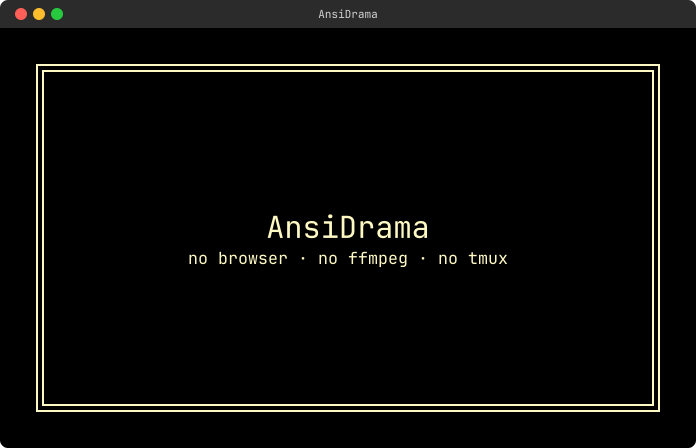
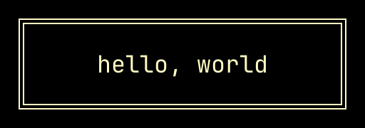
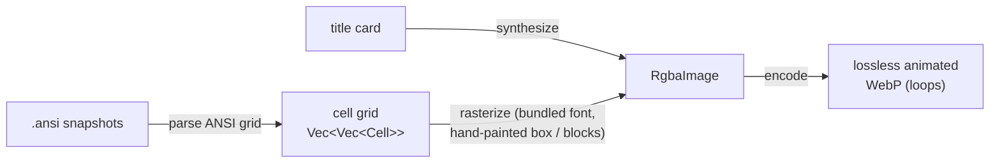

# AnsiDrama

[](https://github.com/oetiker/ansidrama/actions/workflows/ci.yml)



That trailer is itself an AnsiDrama recording — in it you can watch `ansidrama
record hello.toml` run for real. Here is the little WebP that command produces:



Turn a terminal session into a crisp, tiny, **animated WebP** — scripted scenes,
silent-movie title cards, deterministic frames. No browser, no ffmpeg, no
asciinema, no runtime dependencies — a single static binary.

AnsiDrama renders each frame itself: it parses the terminal's ANSI cell grid
and rasterizes it with a bundled monospace font, hand-painting box-drawing and
block glyphs so `─│═▒█…` reach the exact cell edges and tile seamlessly. The
result is a lossless, sharp, loopable WebP that stays small — ideal for a README.



## Two commands

### `encode` — the primitive: frames → WebP

Bring your own frames. Each frame is a captured ANSI snapshot
(`tmux capture-pane -e -p -N > 001.ansi`, or from any harness) **or** a synthetic
title card, held for a duration.

```toml
# demo.toml
cols = 100
rows = 30
out  = "demo.webp"

[[frame]]
card    = { lines = ["eDAPtor", "", "a schema-driven LDAP editor"], fg = "#fef9c3", bg = "#111", bold = true }
hold_cs = 150

[[frame]]
file    = "001.ansi"
hold_cs = 200
```

```sh
ansidrama encode demo.toml            # writes demo.webp
ansidrama encode demo.toml -o out.webp --dump-png frames/
```

### `record` — drive a command in an embedded terminal, capture each frame

```toml
# record.toml
launch       = "myapp --config demo.toml"
cols         = 100
rows         = 30
font_px      = 18         # terminal font (small is fine — it's a dense capture)
card_font_px = 44         # title-card font (larger — read at a glance)
max_fps      = 30         # clamp minimum frame duration
type_cs      = 8          # hold per key / typed char (centiseconds)
move_cs      = 3          # hold per mouse cell-step
out     = "docs/demo/myapp.webp"
env     = { COLORTERM = "truecolor" }
quit_keys = ["C-c"]

[[scene]]
card    = { text = "A quick tour", fg = "#fef9c3" }
hold_cs = 300             # cards want a long hold — time to read

[[scene]]
keys    = ["Down", "Down", "Enter"]   # one frame captured PER key
hold_cs = 100

[[scene]]
click   = { x = 10, y = 11 }          # friendly mouse — no escape codes
hold_cs = 100

[[scene]]
drag    = { from = [18, 8], to = [44, 20] }   # animates one frame per cell
type_cs = 4                                   # per-scene speed override
hold_cs = 120
```

```sh
ansidrama record record.toml
```

## Scenes & frames

Each `record` scene **expands into many frames** — one captured **per key**, **per
typed character**, and **per mouse cell-step** — so keyboard and mouse actions play
out step by step (a corner drag *animates* the resize; typing appears char by
char). Cursor-only moves reuse the last capture; drags re-capture each step so live
UI is shown.

| Field    | Meaning |
|----------|---------|
| `keys`   | named keys, one frame captured per key: `["F10", "Down", "Enter"]` |
| `text`   | a string typed literally, one frame per character |
| `click`  | `{ x, y, button = "left" }` — the pointer moves in, then press + release |
| `drag`   | `{ from = [x,y], to = [x,y], button = "left" }` — one frame per cell |
| `scroll` | `{ x, y, dir = "down", n = 3 }` |
| `card`   | a title card (see below) — no terminal interaction |
| `file`   | (encode only) path to a captured `.ansi` snapshot |

**Timing** (all centiseconds):

| Field | Scope | Meaning |
|-------|-------|---------|
| `hold_cs` | per scene | hold on the **final** frame of the scene — the pause on the result |
| `type_cs` | global + per-scene | hold per key / typed-char frame (typing speed) |
| `move_cs` | global + per-scene | hold per mouse cell-step frame (pointer speed) |
| `font_px` | global | terminal font size → cell size → output resolution |
| `card_font_px` | global + per-card | title-card font (cards aren't bound to the cell grid) |
| `max_fps` | global | clamps the minimum per-frame hold |

Keyboard/typing frames draw the app's **text caret** (from the embedded terminal's cursor); mouse
frames draw the **pointer** — set `cursor = false` to disable both.

Exactly one action per scene. Coordinates are 1-based terminal columns/rows. Mouse
actions expand to SGR (1006) mouse reports under the hood, so you never write
`\x1b[<0;10;11M` by hand — a raw escape in `keys` still works as an escape hatch.

## Title cards

Silent-movie intertitles: a solid panel with centered text inside a double-line
frame.

```toml
card = { text = "Browse. Edit. Save.", fg = "white", bg = "black", bold = true, border = true }
# or multi-line:
card = { lines = ["Chapter one", "the directory tree"] }
```

Colours are `#rrggbb`, `#rgb`, or a basic name (`black white red green blue
yellow grey`). `border` (default `true`) draws the frame.

## Install

**Prebuilt binaries** (Linux static-musl x86_64/aarch64, macOS x86_64/aarch64) —
download the tarball for your platform from the
[Releases page](https://github.com/oetiker/ansidrama/releases), unpack, and put
`ansidrama` on your `PATH`:

```sh
tar xzf ansidrama-*-x86_64-unknown-linux-musl.tar.gz
sudo install ansidrama/ansidrama /usr/local/bin/
```

**Debian/Ubuntu** — grab the `.deb` from the release and:

```sh
sudo dpkg -i ansidrama_*_amd64.deb
man ansidrama
```

**Fedora/RHEL/openSUSE** — grab the `.rpm` and:

```sh
sudo rpm -i ansidrama-*.x86_64.rpm
```

**From source:**

```sh
cargo install --path .        # or: cargo build --release
```

`record` embeds its own terminal (a PTY + VT parser), so it needs **nothing but
the binary** — same as `encode`. The font (JetBrains Mono, OFL) is bundled.

## How it compares

AnsiDrama captures a frame **per input event** (each key, char, and mouse
cell-step), so it animates typing, navigation and drags step by step — but each
frame is a settled screen grab, not a real-time video. Every run is
**deterministic** (same script → same bytes) and the output is **lossless, crisp
and small**. For true real-time video with a headless browser and ffmpeg →
GIF/MP4, reach for [VHS](https://github.com/charmbracelet/vhs); AnsiDrama trades
that for determinism, sharpness and a zero-dependency single binary.

## License

MIT (see `LICENSE-MIT`). Bundled JetBrains Mono is under the SIL Open Font
License (see `assets/JetBrainsMono-LICENSE.txt`).
